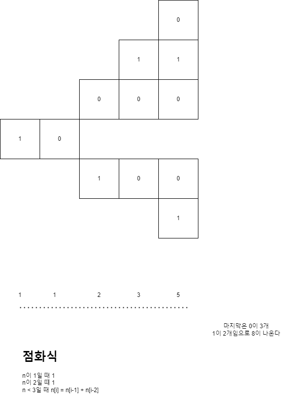

# BOJ_2193_이친수

- `문제 보기` : 이진수는 0과 1로 이뤄진 숫자이다. 여기서 좀더 추가적인 특징이 들어간 것이 이친수라고 할 수 있다. 해당 특징을 만족하면 이친수이다.
    1. 이친수는 0으로 시작하지 않는다.
    2. 이친수에서는 1이 두 번 연속으로 나타나지 않는다. 즉, 11을 부분 문자열로 갖지 않는다.
    
    N의 범위가 (1 ≤ N ≤ 90)일 경우 N자리의 이친수를 구해야 한다.
    
- `문제 이해` : 모든 경우의 수를 계산한다면 2^n 시간 복잡도가 발생하기 때문에 실패하게 된다. 해당 문제는 dp를 적용할 수 있는지 생각해보아야 한다.
- `문제 풀이` : 해당 문제를 풀기위해서 규칙을 찾아야 한다. 아래와 같이 n의 값을 1부터 증가시키면서 이친수를 구해보았다. 그랬더니 아래와 같은 점화식을 도출해낼 수 있었다. 주의할 점은 n이 90까지 가게 된다면 21억을 초과하는 숫자가 되기 때문에 long 을 사용하여야 한다.

